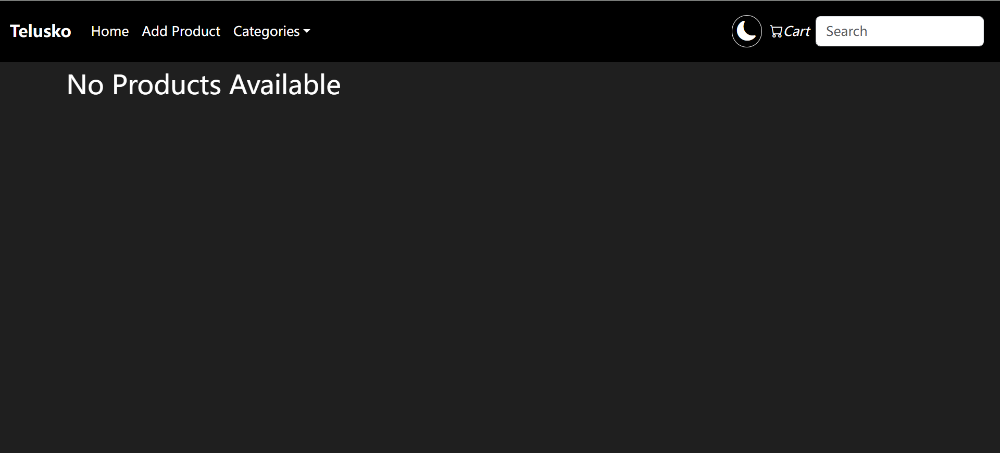
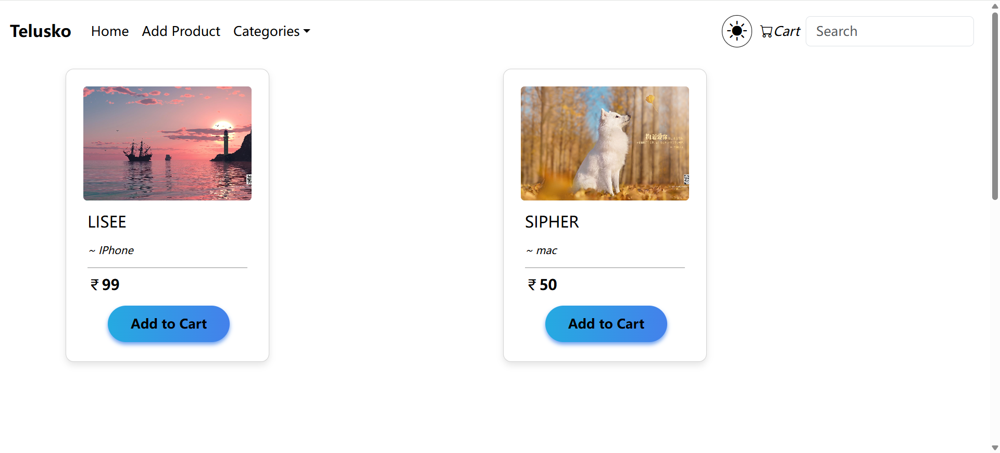

## E-Commerce website project

The e-commerce project is a frontend-backend decoupled project. The backend is developed in Java using Springboot framework. The frontend in developed using React.js. 

The frontend and backend server use different port numbers. To run the frontend code, please make sure that Node.js runtime environment is pre-installed on your local machine and execute command `npm install` and `npm run dev` in cmd. 

The user can add products manually. 

